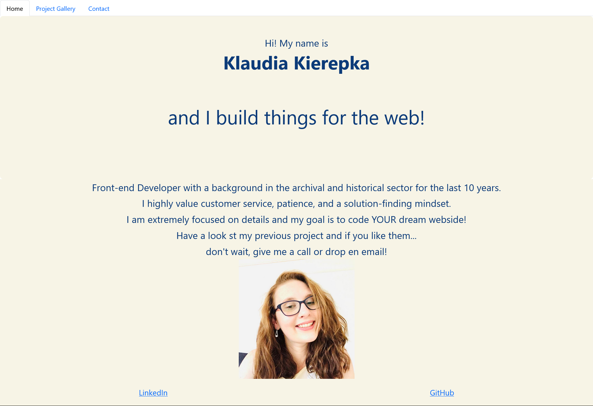
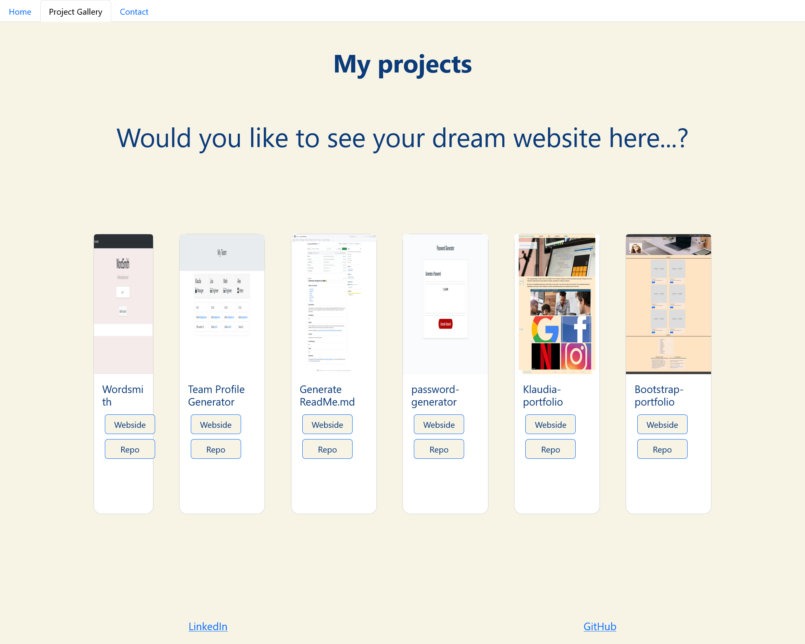
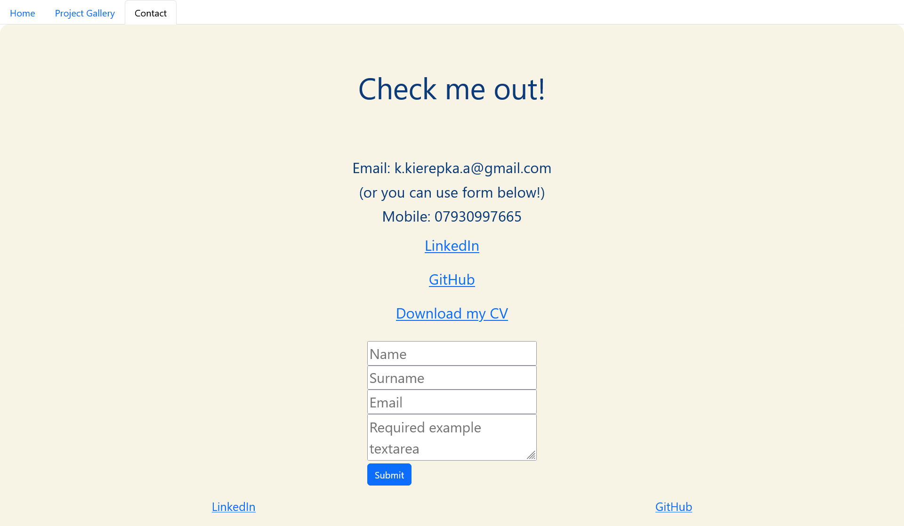

# React-Portfolio

## Description

This project I made for myself, as a demo of my skills. It provides future customers with a view into my most recent application and gives them the possibility to get to know me and to contact me. I will help in the future to demonstrate my abilities and get engaged in new projects.

## Installation

N/A

## Usage

Webpage should be used as a demo of services that I am providing for their customers with examples of deployed applications. Please see screenshots 
  

## Credits

N/A

## License

Please refer to the LICENSE in the repo

## Badges

N/A

## Features

N/A

## How to Contribute

N/A

## Link

https://klaudia102.github.io/Bootstrap-Portfolio/